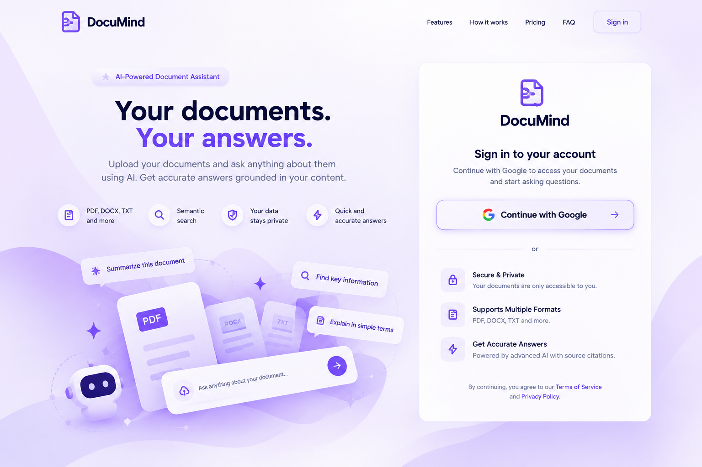
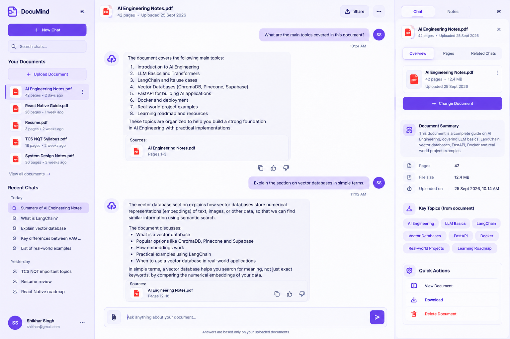
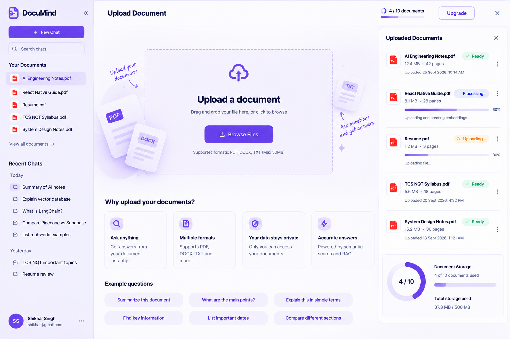
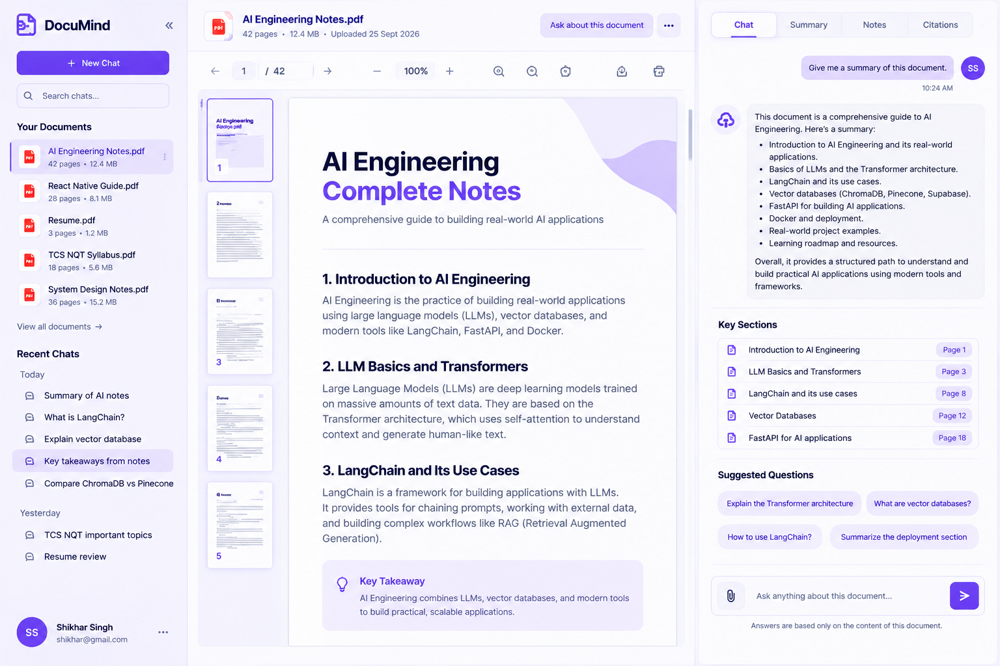
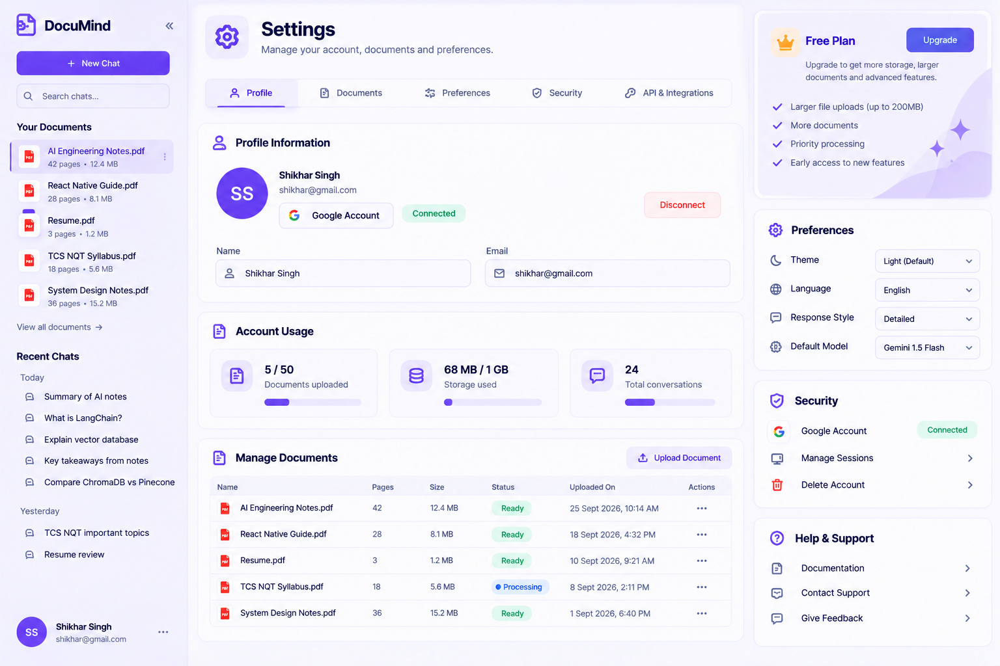

# DocuMind

DocuMind is an intelligent document question-answering web application. It empowers users to sign in, upload their own documents, and engage in a conversational interface to ask questions directly about the contents of those documents. 

## Use Cases

- **Information Retrieval**: Quickly find specific answers from lengthy PDFs or text documents without having to read through the entire file.
- **Research & Study**: Easily extract relevant passages and insights from research papers, articles, or study materials.
- **Grounded Q&A**: The system uses Retrieval-Augmented Generation (RAG) to ensure that the answers provided are strictly grounded in the uploaded documents, reducing hallucinations and providing source references for verification.
- **Secure Document Management**: Users have isolated access to their own documents and chat history, secured by Google OAuth and role-based access control.

## Screenshots

Here is a glimpse of the application's interface:

### 1. Login
Secure Google sign-in page to access your workspace.

### 2. Chat Workspace
The main interface where users can interact and ask questions about their documents.

### 3. Upload Document
Easy drag-and-drop interface for uploading new documents for processing.

### 4. Document Viewer
View your uploaded documents alongside their metadata and processing status.

### 5. Settings
Manage your account preferences and application settings.

